# Trading Nexus - Complete Project Flowchart

## 🎯 Project Overview

**Trading Nexus** is a comprehensive trading platform with statutory charge calculation capabilities, built with FastAPI backend and React frontend, deployed via Docker containers.

---

## 📊 System Architecture Flowchart

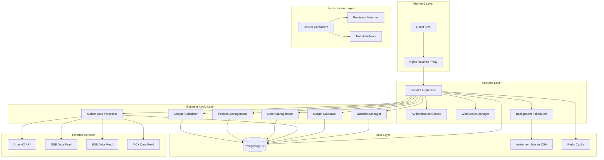

---

## 🔄 Data Flow Architecture

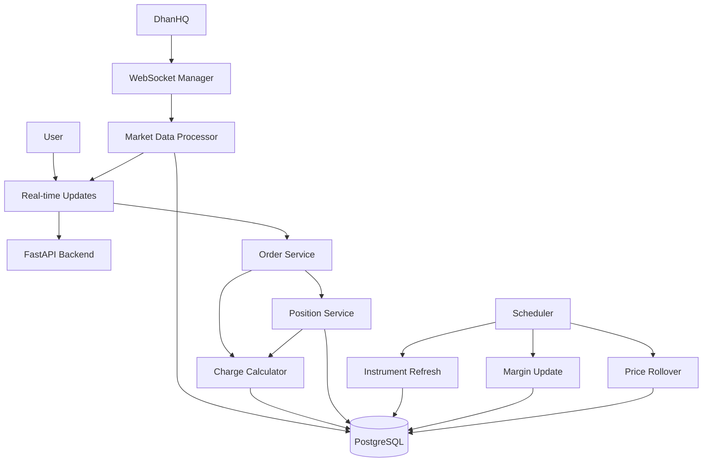

---

## 🏗️ Component Architecture Flowchart

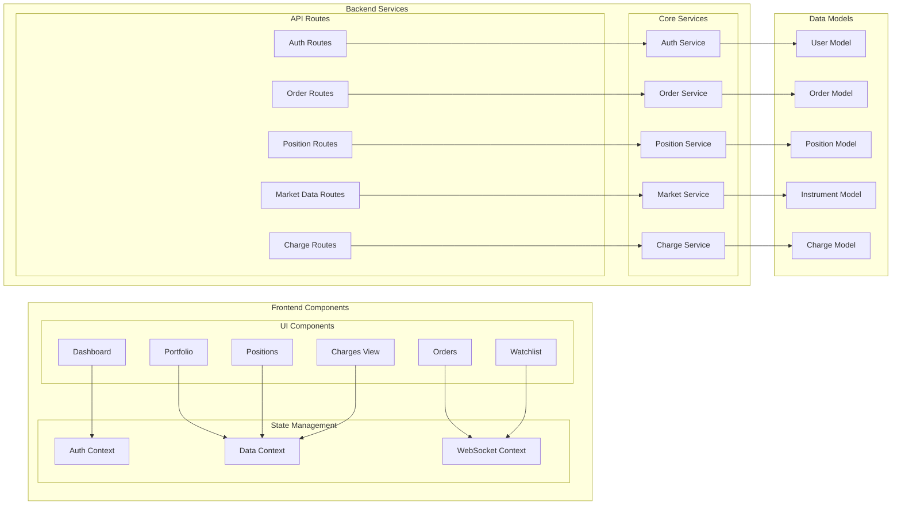

---

## 📈 Trading Flow Process

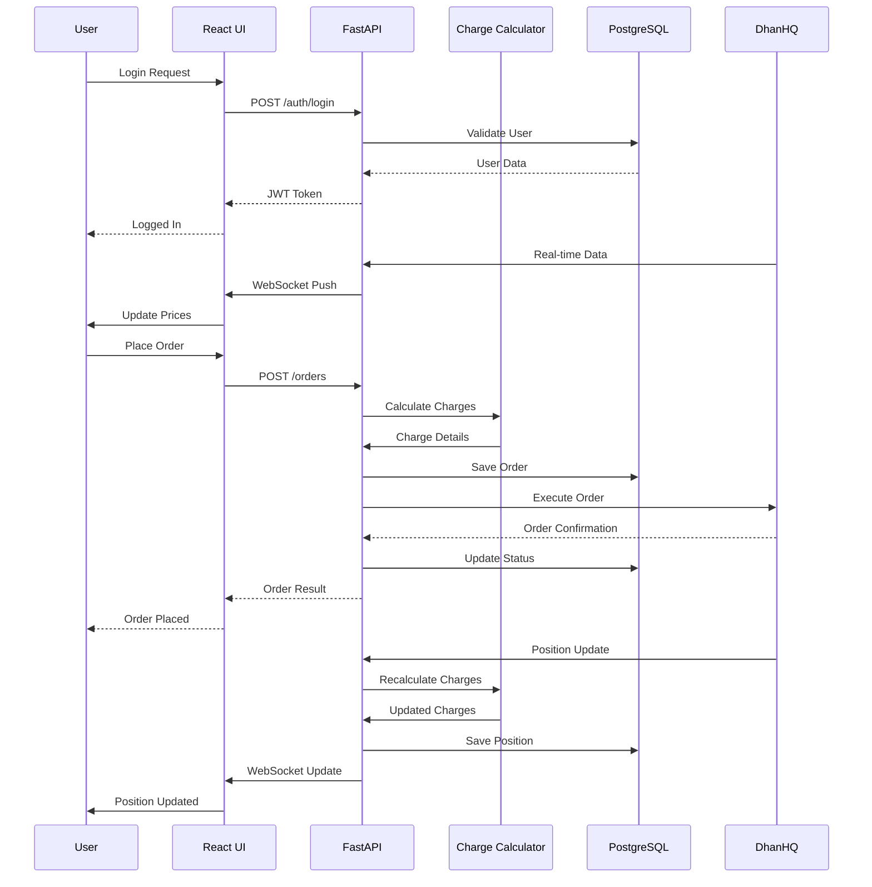

---

## 🧮 Charge Calculation Flow

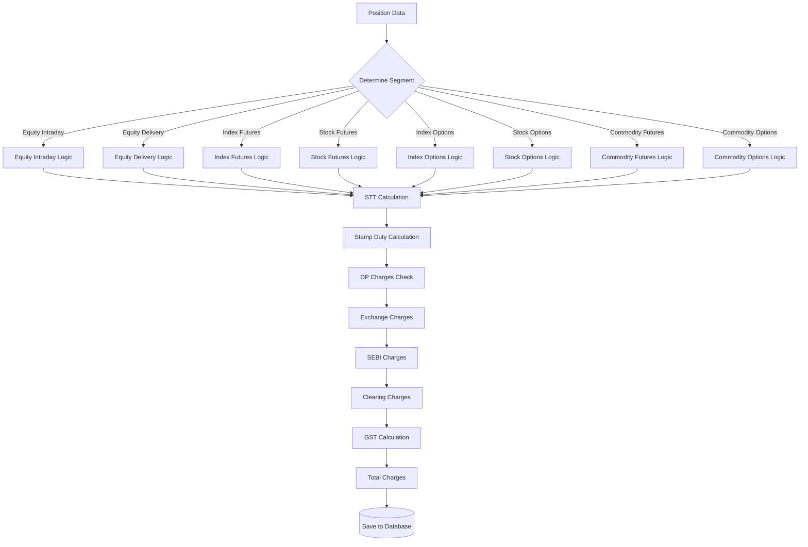

---

## 🐳 Docker Deployment Flow

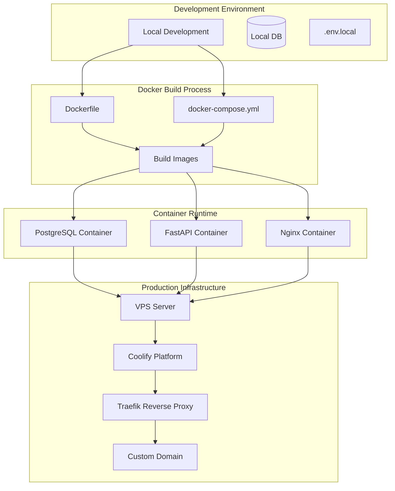

---

## 📊 Database Schema Flow

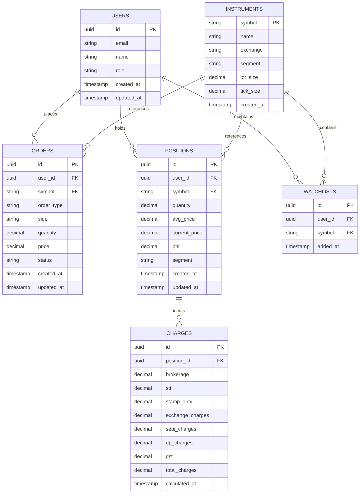

---

## 🔄 WebSocket Communication Flow

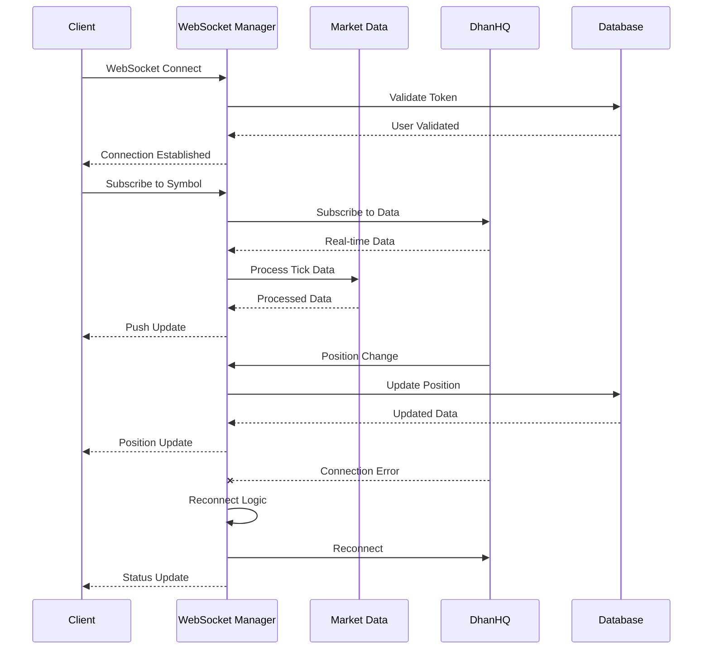

---

## 🚀 Deployment Pipeline Flow

```mermaid
graph LR
    subgraph "Development"
        CODE[Code Changes]
        TEST[Unit Tests]
        LINT[Code Quality]
    end

    subgraph "Build"
        BUILD[Docker Build]
        SCAN[Security Scan]
        TAG[Version Tag]
    end

    subgraph "Staging"
        DEPLOY_STAG[Staging Deploy]
        INTEGRATION[Integration Tests]
        E2E[E2E Tests]
    end

    subgraph "Production"
        DEPLOY_PROD[Production Deploy]
        MONITOR[Health Monitoring]
        ROLLBACK[Rollback if Needed]
    end

    CODE --> TEST
    TEST --> LINT
    LINT --> BUILD
    BUILD --> SCAN
    SCAN --> TAG
    TAG --> DEPLOY_STAG
    DEPLOY_STAG --> INTEGRATION
    INTEGRATION --> E2E
    E2E --> DEPLOY_PROD
    DEPLOY_PROD --> MONITOR
    MONITOR --> ROLLBACK
```

---

## 📱 User Journey Flow

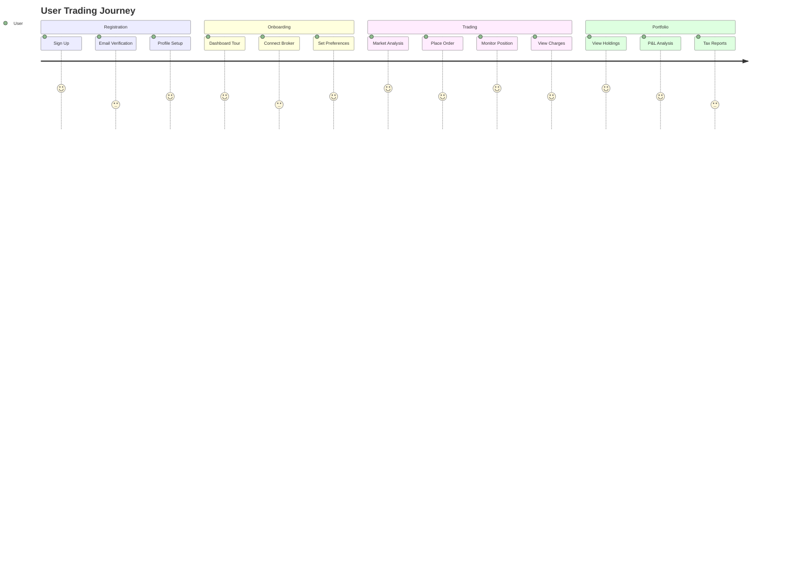

---

## 🔧 Configuration Management Flow

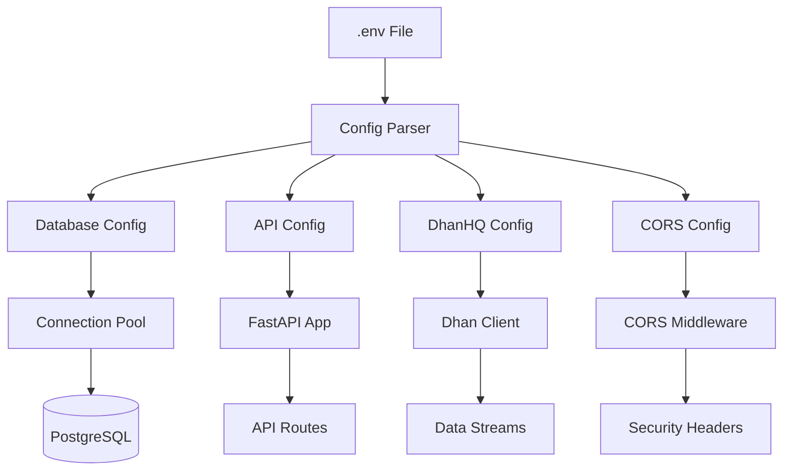

---

## 📊 Monitoring & Logging Flow

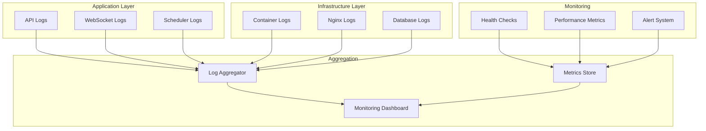

---

## 🎯 Key Features Flow Summary

### Core Trading Features
- **Real-time Market Data**: WebSocket-based live price feeds
- **Order Management**: Complete order lifecycle management
- **Position Tracking**: Real-time position updates with P&L
- **Charge Calculation**: Statutory compliant charge calculations
- **Watchlist Management**: Customizable watchlists

### Technical Features
- **Microservices Architecture**: Modular, scalable design
- **Docker Deployment**: Containerized deployment
- **Database Persistence**: PostgreSQL with proper schema
- **Authentication**: JWT-based secure authentication
- **Real-time Updates**: WebSocket for live data

### Business Features
- **Multi-Exchange Support**: NSE, BSE, MCX integration
- **Multiple Segments**: Equity, Futures, Options, Commodities
- **Statutory Compliance**: SEBI/NSE/BSE/MCX compliant
- **User Management**: Role-based access control
- **Reporting**: Comprehensive charge and P&L reports

---

## 📈 Performance Optimization Flow

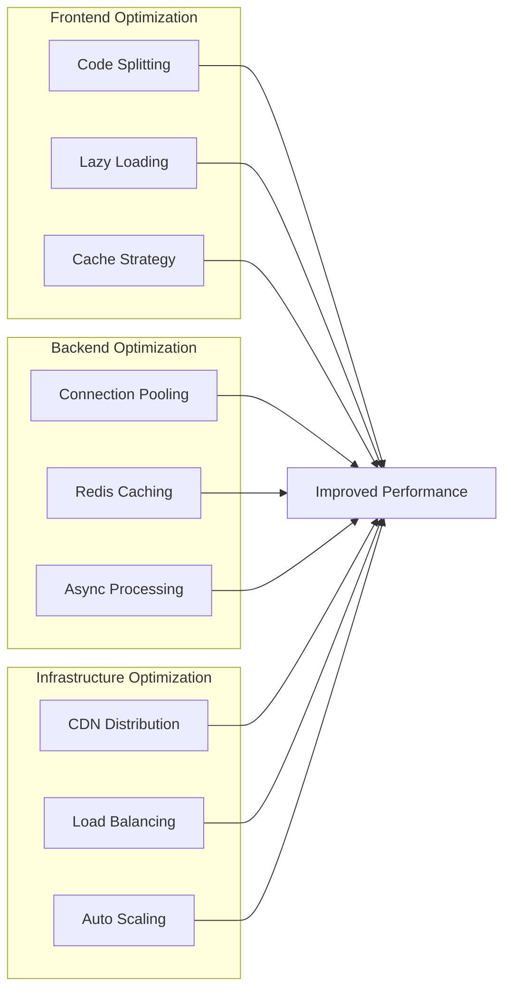

---

## 🔒 Security Architecture Flow

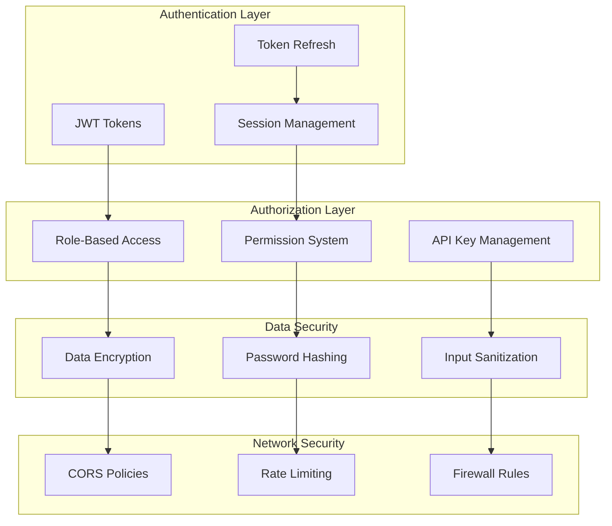

---

## 📋 Summary

This comprehensive flowchart illustrates the **Trading Nexus** platform's complete architecture, covering:

1. **System Architecture**: Multi-layered design with clear separation of concerns
2. **Data Flow**: Real-time data processing and storage
3. **Component Architecture**: Modular frontend and backend components
4. **Trading Process**: Complete order-to-position lifecycle
5. **Charge Calculation**: Statutory compliant charge processing
6. **Deployment**: Docker-based containerized deployment
7. **Database Design**: Relational schema with proper relationships
8. **Communication**: WebSocket-based real-time updates
9. **Pipeline**: CI/CD deployment workflow
10. **User Journey**: Complete user experience flow
11. **Configuration**: Environment and configuration management
12. **Monitoring**: Comprehensive logging and monitoring
13. **Performance**: Multi-layer optimization strategies
14. **Security**: End-to-end security architecture

The platform is designed for **scalability**, **security**, and **regulatory compliance** while providing an excellent **user experience** for trading activities.
